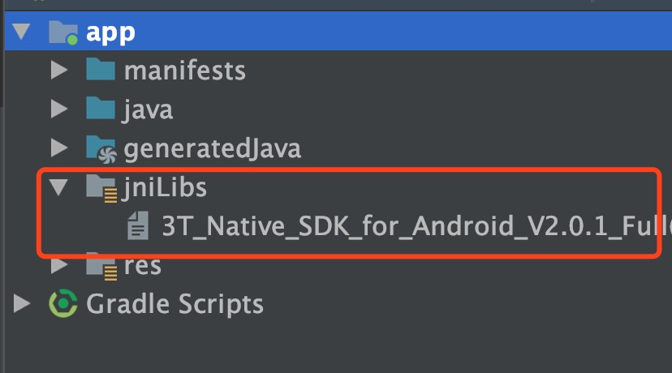

# 在线语音聊天室
语音聊天室是一种纯音频的实时互动使用场景。用户可以创建语音聊天房间，听众以副播或观众的身份加入房间进行语音聊天，也可以在房间内任意切换自己的副播/听众身份，即上麦/下麦的过程。

常见的几种语音聊天室类型及特点：

> 语音交友: 房间内多个用户需要频繁上下麦，用户不想花费过多流量

> 开黑语音: 频道内用户数相对固定，用户对声音延迟要求较高

> 情感电台: 对音质要求较高，声音还原度高，模拟电台语音聊天，语音电台主播首选

# 功能列表

1. 创建 TTT 音频引擎对象 [create](http://www.3ttech.cn/index.php?menu=72&type=Android#create)
2. 设置频道通信模式 [setChannelProfile](http://www.3ttech.cn/index.php?menu=72&type=Android#setChannelProfile)
3. 设置用户角色 [setClientRole](http://www.3ttech.cn/index.php?menu=72&type=Android#setClientRole)  麦上用户: BROADCASTER， 麦下用户: AUDIENCE
4. 启用说话音量提示 [enableAudioVolumeIndication](http://www.3ttech.cn/index.php?menu=72&type=Android#enableAudioVolumeIndication)
5. 加入频道 [joinChannel](http://www.3ttech.cn/index.php?menu=72&type=Android#joinChannel)
6. 离开频道 [leaveChannel](http://www.3ttech.cn/index.php?menu=72&type=Android#leaveChannel)
7. 静音/取消静音，可选操作 [muteLocalAudioStream](http://www.3ttech.cn/index.php?menu=72&type=Android#muteLocalAudioStream)
8. 静音/取消静音所有远端用户，可选操作 [muteAllRemoteAudioStreams](http://www.3ttech.cn/index.php?menu=72&type=Android#muteAllRemoteAudioStreams)
9. 听筒扬声器切换，可选操作 [setEnableSpeakerphone](http://www.3ttech.cn/index.php?menu=72&type=Android#setEnableSpeakerphone)
10. 设置高音质，可选操作 [setHighQualityAudioParameters](http://www.3ttech.cn/index.php?menu=72&type=Android#setHighQualityAudioParameters)
11. 伴奏播放，可选操作 [startAudioMixing](http://www.3ttech.cn/index.php?menu=72&type=Android#startAudioMixing)

# 示例程序

#### 准备工作
1. 在三体云官网SDK下载页 [http://3ttech.cn/index.php?menu=53](http://3ttech.cn/index.php?menu=53) 下载对应平台的 语音通话SDK。
2. 登录三体云官网 [http://dashboard.3ttech.cn/index/login](http://dashboard.3ttech.cn/index/login) 注册体验账号，进入控制台新建自己的应用并获取APPID。

#### Android

1. 解压下载的 SDK 压缩包，内容如图所示

2. 用Android Studio，打开**TTT\_ANDROID\_CHATROOM** Demo工程，文件列表如图所示，复制**3T\_Native\_SDK\_for\_Android\_Vx.x.x\_Full.aar** 到工程 **app** 项目下的 **libs** 目录下。
 
 
 
3. 引用aar包。在app项目下的build.gradle文件中添加红框中相应代码来引用。
 
 
 

4. 将申请到的**APPID**填入 SDK 的初始化函数 create 中，如下图所示。

5. 最后编码代码即可运行Demo。

	运行环境:
    * Android Studio 3.0 +
    * minSdkVersion 16
    * gradle 4.6
    * java 7.0

	Android权限要求:
	
     * **android.permission.RECORD_AUDIO** ---> SDK音频模块需要使用此权限用来访问麦克风，用于获取本地音频数据。
     * **android.permission.INTERNET** ---> SDK的直播和通讯功能，均需要使用网络进行上传。
     * **android.permission.BLUETOOTH** ---> SDK的直播和通讯功能，均需要访问蓝牙权限，保证用户能正常使用蓝牙耳机。
     * **android.permission.BLUETOOTH_ADMIN** ---> 蓝牙权限。
     * **android.permission.MODIFY\_AUDIO\_SETTINGS** ---> SDK的直播和通讯功能，均需要访问音频路由，保证能正常切换听筒，扬声器，耳机等路由切换。
     * **android.permission.ACCESS\_NETWORK\_STATE** ---> SDK的直播和通讯功能，均需要访问网络状态。
     * **android.permission.READ\_PHONE\_STATE** ---> SDK的直播和通讯功能，均需要访问手机通话状态。

# 视频教程
安卓端SDK集成视频教程：[https://v.qq.com/x/page/h0740eg9f8q.html]()

iOS端SDK集成视频教程：[https://v.qq.com/x/page/u0738fgva34.html]()

# 常见问题
1. 由于部分模拟器会存在功能缺失或者性能问题，所以 SDK 不支持模拟器的使用。